## QGIS Resources for Mariners

This site contains a set of QGIS project files and associated documentation
for people seeking to create high quality nautical charts with QGIS. Some
projects are templates that can be downloaded and are immediately ready to
use, with no dependencies on other files in the GitHub repository. Others are
designed to be used in conjunction with resources in the repository.

The materials here were created by [Joe Berkovitz](https://www.joeberkovitz.com/contact/),
a sea kayaker based in Marblehead, MA.

**NOTE: The content available from this site is for informational purposes only and is not to be used for navigation.**

**NOAA charts are provided here subject to the [RNC User Agreement](https://charts.noaa.gov/RNCs/Agreement.shtml).**

## NOAA Chart Project Template

This QGIS project includes useful components to get started creating
high-quality nautical charts based on NOAA raster marine charts. It includes
the following:

- **Data layers for making charts**. These include NOAA RNC marine charts,
satellite imagery, street maps and magnetic north lines among other things. The
resolution and scale of these layers depends on the scale at which they are
viewed. All data is downloaded over the internet so there is no need to get hold
of specific files for specific areas.

- **Sample chart layouts**.  A set of sample project layouts is ready-made for
duplication in 11x17 landscape and portrait. Each layout has a map, title,
scale bar, and lat/long grid.

- **Chart footprints**. A data layer that makes it easy to locate and download
specific NOAA charts in a georeferenced format, with various scales for chart
preparation.

**[Download NOAA-Template.qgz](NOAA-Template.qgz)**

*Note: if the above template does not load, it may be due to an outage in NOAA's
Seamless RNC web service. If so, [this template](NSPN-Workshop-Template-2.qgz)
can be used instead although it is limited to the New England area.*

## Quick guide to making raster charts

This guide describes how to:
- Download the QGIS program installer
- Open the template project in QGIS
- Use the QGIS map and layers to view areas of the world
- Make a layout of a specific chart
- Export a layout to a PDF file

QGIS is a very complex program and there is much more to discover about it
than this guide can describe. For detailed information, or where a question is not
answered here, please consult the
[QGIS Desktop User Guide](https://docs.qgis.org/3.16/en/docs/index.html).

### Download QGIS

QGIS makes intensive use of CPU and graphics, similar to a video game or
illustration program. You will need a MacOS, Windows or Linux computer that is
reasonably powerful, and a reasonably large high-resolution monitor. A
multicore machine with at least 8 GB of RAM is recommended.

Begin by downloading the QGIS application for your computer from
[download.qgis.org](https://download.qgis.org). Use the Long Term Release (as
of this writing, 3.16). Do not install the Latest release (3.18) as it is
prone to crash.

**Windows note:** Use the Standalone Installer for 64-bit Windows.

**Mac OS note:** The first time you run the QGIS application, it will complain
that the app "cannot be opened because it cannot be checked for malicious
software". This is in fact normal. You can get around it by right-clicking the
application icon in the Applications folder, choosing *Open* from the menu,
and then clicking *Open* on the resulting dialog box.

Also download the template project described [above](#noaa-raster-charts-template) and copy it
to a new folder that you will be using to create your charts. You may wish to change its name also
since it will no longer be a template once you start changing it.

Depending on the type of computer you are using, you may need to run an
installer program. Follow the instructions for your particular download.

### Open the template project

Start the QGIS application and use **Project > Open...** to open the template project.
In the future you can use **Open Recent >** as a shortcut.

(Note that your computer may not know how to open QGIS .qgz project files to start with. You can
tell it how to do that, usually the first time you try to open one, when your machine complains.)

When you open the project up, in the center of the window you will see the
main map that QGIS uses, called the **Map View**. The next section describes
how to work with this view.

### Use the Map View and Layers

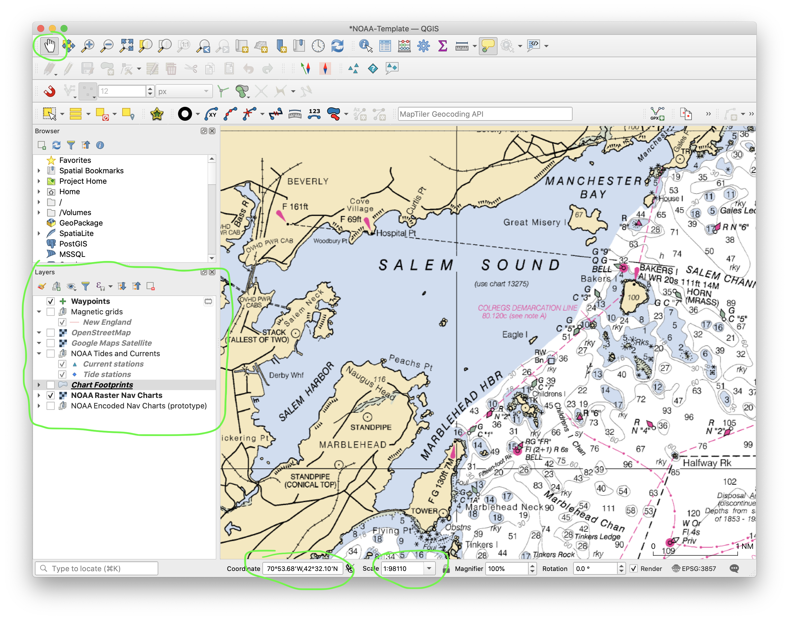

The **Map View** is where you choose areas of the world to look at and decide
what information you want to view, or make charts of. You can also create
routes and waypoints in this view.

A few important items in the view are circled above:

- At the top, the **Pan** tool (hand) lets you move the map around
laterally by clicking and dragging. To its right you can also see **Zoom In** and
**Zoom Out** tools.

- On the left side of the screen the **Layers panel** shows the set of
*layers* available for viewing in the map. A checkbox next to a layer means
you can see it in the map view.

- On the bottom, the **Coordinates** box shows the latitude and longitude of
the mouse position.

- On the bottom, the **Scale** control displays and also controls the scale of
the map view.

#### Pan and zoom the map

You can move the map from side to side and zoom in and out. Become familiar
with the way that this works and read the [QGIS documentation on the map view](https://docs.qgis.org/3.16/en/docs/user_manual/introduction/qgis_gui.html#map-view).

Whenever the **Pan** tool is selected you may click and drag the map using your
mouse to move it around. You can also drag the map without clicking by holding
down the spacebar at the same time, which is useful when you're using a tool
other than the Pan tool.

To zoom the map in and out, use exactly the same technique you would use to
make any window *scroll up* (which causes QGIS to zoom out) or *scroll down*
(zoom in). The exact technique varies from one computer to another. On most
trackpads, dragging two fingers up or down works for this. On a Windows-style
mouse that has a mechanical scroll wheel, the wheel does the trick. Hold down
the Command (Mac) or Alt (Windows) key to zoom more slowly.

You can also type a scale directly into the **Scale** control at the bottom of the window.

#### Control the map layers

Similar to Adobe Illustrator and many drawing programs, QGIS maps display a
set of visual layers that can be independently turned on and off. These are
shown in the Layers panel at lower left. 

When you first open the template project, a layer for NOAA marine charts is
turned on. Each layer has its own checkbox enabling it. Layers are also placed
into a hierarchy of groups that can also be turned on and off. Try checking
and unchecking the various boxes to see what the layers and groups contain.

Layers included in the template project include:

- *Waypoints* includes general-purpose markers that you create yourself. It is initially empty.

- *OpenStreetMap* topo/street map view (similar to Google Maps' Default view).

- *Google Maps Satellite* imagery layer. Very handy for seeing what areas
actually look like.

- *Current stations* and *Tide stations* providing NOAA predictions. Hovering
over a station will display the station name and a link to its NOAA home page
where tide or current predictions can be viewed.

- *Raster Chart Downloads* show the locations of various NOAA printed
charts at different scales. You can use these to preview and download charts
for inclusion in your maps.

- *NOAA Raster Nav Charts* layer. This is a "tiled" version of the NOAA printed
nautical charts, which is automatically downloaded from NOAA web servers. You
do not need to download any files to see these tiles. The type of the chart that is
displayed (e.g. general, coastal, harbor) depends on the scale at which you
are viewing this layer.

The order of the layers is important, as layers on top can obscure layers on
the bottom. They can be dragged around and reordered. They are also placed in
groups which can be turned on and off to control the visibility of every layer
inside the group.

For most purposes, the *Raster Nav Charts* and a *Magnetic grid* layer (if you
want it) will give you a useful chart.

If you get lost and don't see anything in the map view, this may be
because the layers that are turned on don't have any material in the area
where your map is pointed. To get your bearings, turn on the *OpenStreetMap*
layer (which covers the whole globe) and zoom out to figure out where you are.

### Make a chart using a QGIS Layout

The main map view is just a way to inspect the map data in QGIS. It is not a chart.
To make a chart, you use a QGIS object called a **Layout**. Each layout is a
complete design for showing a map with all the associated information that goes
with it, such as scale bars, labels, a title, and so on. Once you have a layout,
it can then be exported to a PDF file.

Layouts are part of your project. Whenever you save the project, all of your defined
layouts are saved along with it.

The steps in making a layout are:

- Set up the main map view and layers to show the information of interest
- Create and name a print layout for your map
- Pan, zoom and rotate the layout's map as desired
- Edit and adjust the title and scale bars
- Add any other decorations, such as descriptive text

#### Setting up the map to make a layout

Once you're familiar with the **Map View**, this is quite straightforward. Pan
and zoom the map so it shows approximately the area you want to have in your
chart, at about the right scale. The Map View does not have to be perfect,
because you will adjust all the details in the Layout you are about to create.
Just get it in the ballpark.

A lot of detail will still be missing, because QGIS automatically uses an
overview-level chart so as to keep everything readable on the screen.  If you
were making a chart of Salem Sound, your Main Map might now look like this:

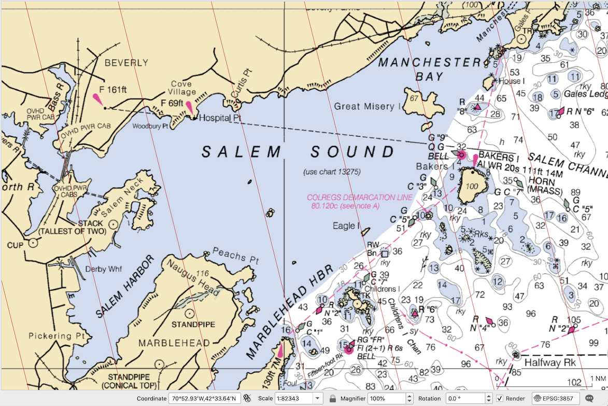

#### Creating your layout

To make your layout, you will copy an existing layout that is already set up, and then
plug in the area of interest.

In the main map view window choose **Project > Layout Manager...**. You'll see a window
like this appear:

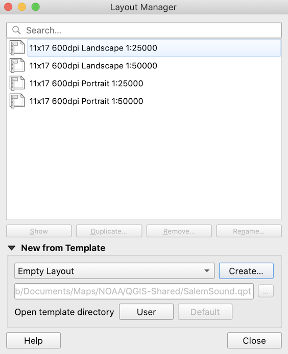

There is one of each of these premade 11x17" layouts for each choice of
chart orientation (Portrait, Landscape) and each choice of scales (1:25K and 1:50K).
The scale choices differ only in the grid labels: 1:25K is labeled every
minute, while 1:50K is labeled every 2 minutes.

Pick the orientation you want, and click the **Duplicate...** button below the list.
You can give your new layout a name.

#### Syncing the layout to the main map

Now your layout will be open in its own window, but it will be showing the
wrong area: it will display whatever was originally put into the premade
layout. Your first step is to make it show the same area as the main map.

Begin by clicking the map to select it, and then open the **Item Properties**
tab in the panel on the right (circled in the figure below). (The first time
you select the map, you may not have an Item Properties tab -- if so, then
right-click the map and select *Item Properties...* from the popup menu.) Your
layout window should now look something like this:

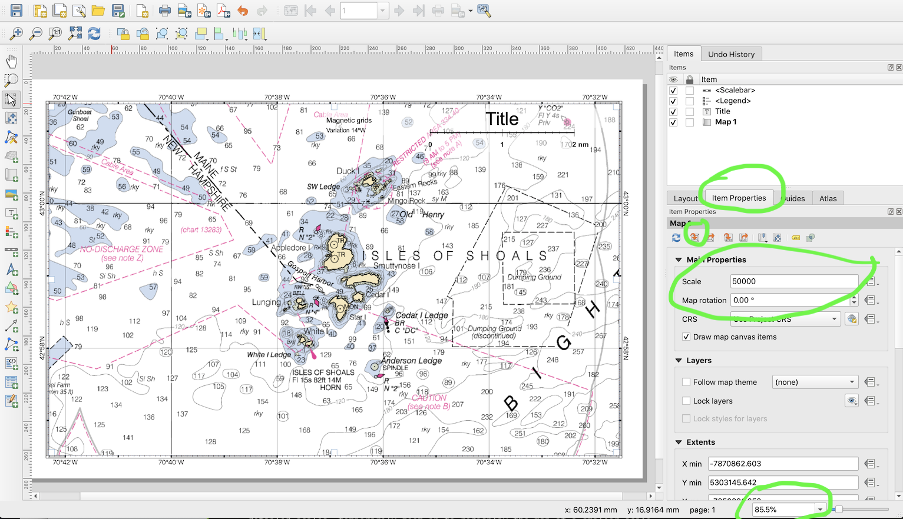

Click the small red icon in the Item Properties tab circled above, whose full
name is **Set Map Extent to match Main Canvas Extent**: a fancy way of saying,
make this layout's map show the same area as the main map. Here's a detail of
that area of the window:

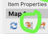

Click this button, and the map should change
to show the same area as the main map. If it doesn't, try clicking the blue
**Update Map Preview** icon just to its left, then try again.

#### Adjust the layout map to the exact position and scale you want.

Leaving the map selected, use the **Edit > Move Content** menu command to
choose the content scrolling tool. (Notice that this changes the selected tool
in the toolbar on the left of your screen: you can click the tool icon to
accomplish the same thing.)

Now your mouse/trackpad will pan and zoom what is _inside_ the selected
map (as opposed to zooming the view of your layout or dragging the map around
the page). Pan and zoom until you have everything just the way you want it.
You can also adjust the scale and map rotation by typing the values in the
Item Properties panel.

When you are done, use the **Edit > Select/Move Item** command to go back
to using your mouse to select and move items on the map.

#### Edit the labels, scale bar and anything else you want.

At this point you may drag the other items on the map anywhere you like, to
get them out of the way of things on the map that you would like to look at.

You can edit text and all other attributes of the current selected object in
the **Item Properties** panel at any time.

This is also the point at which you can add special text, markers, lines, etc.
that are unique to this layout (as opposed to shared with other layouts).

#### Export the layout to PDF

At this point, your chart is ready to export to PDF. Most likely it still does
not show the right level of detail though -- but still, no worries on that
score. (If you really want to preview the chart at
the level of detail in which it will appear on the final PDF, magnify the
layout view scale to 400% using the Scale box at the lower right of the
window, then use **Edit > Pan Layout** to move the layout around on the screen
to see how it looks at full scale.)

The last step is to export the finished layout to PDF using the **Layout >
Export as PDF…** menu command. You will specify the filename to which the PDF
is to be exported. This may take some time as many detailed images may need to
be downloaded; during this time, the program will likely be unresponsive. When
QGIS is done, it will display a green notice at the top of the layout window
and you will now have your finished chart as a PDF.

Here's [an example](guide/charts/SalemSound.pdf). (It's a large file and you
may need to view it in Acrobat rather than in your web browser.)

### Overlaying a magnetic north grid on your map

This website includes pre-made magnetic north grid lines for New England and the
West Coast. To use these, use [this link](vector/magneticNorth/gridPackage.gpkg)
to download the `gridPackage.gpkg` layer data. Once downloaded, drag and drop the file
onto your QGIS map window and select the grids of interest to load. You can turn these
layers on in order to make them visible in a Layout before you export it to PDF.

Note that you can make your own magnetic grids for any desired location using the 
[Compass Routes plugin](#compass-routes-plugin) as described below.

### Including specific NOAA charts in your map

The recipe given above is the quickest and easiest way to make a chart, but
you lose the ability to control which scale of NOAA charts are actually used.
The automatically downloaded map tiles just give you whatever NOAA thinks is
most appropriate for the size of map you are printing, which may not be what
you want. You just have to see and find out. If the result isn't working for
you, often it will be because the automatic scale is too detailed which
creates readability problems for an 11x17" map on a kayak deck. Including
specific charts at 1:40000 or 1:80000 is often best.

Downloading and using a specific chart in your map also ensures that you get
the crispest and sharpest possible resolution in your final printout.

You can easily preview, download and include any NOAA chart into QGIS in a way
that will automatically fit them together seamlessly. Begin the process by
activating the *Raster Chart Downloads* layer by checking its visibility box, and
clicking its name. Click the little triangle to expand the choices of chart scales.
Your screen should look like this:

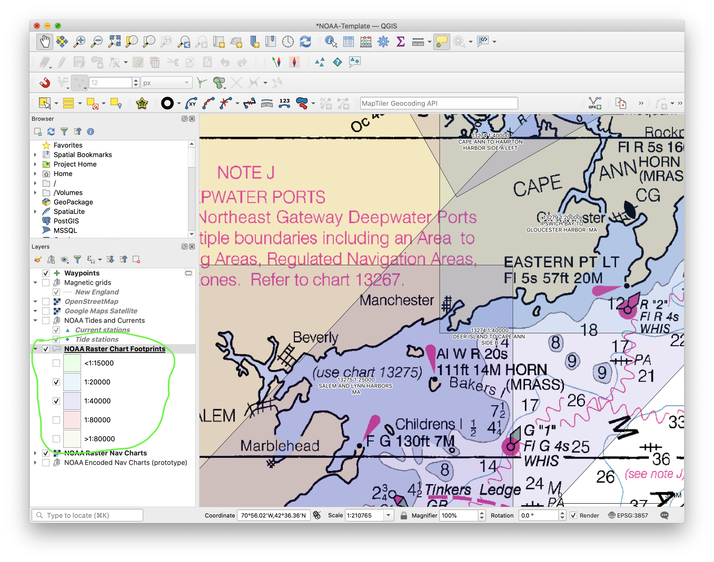

Next, use **View > Identify Features** to switch the mouse cursor to the
*Identify* tool, which lets you interact with specific chart download
footprints. With this tool, *right-click* the chart you want to download. You
will see a menu offering a choice of charts; for each chart, there is a
sub-choice of Preview Chart or Download Chart Layer:

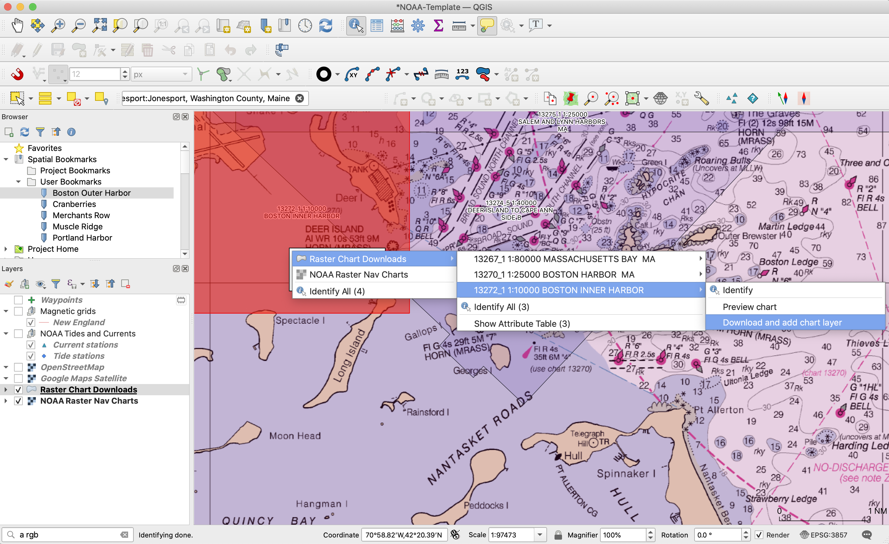

It's a good idea to Preview first to make sure you know what you are getting,
as the chart images are large can take some time to download and process.

When you choose Download, a box will come up to show you the progress of the download.
You will also have to click through a number of other steps that take a bit of time.
When completed, the downloaded map file will be saved in a folder alongside your
your QGIS project named `NOAA-raster/`, and a brand new map layer will be added to your project. 

At this point, turn OFF the regular NOAA Charts and Downloads layers, and
zoom into the area of interest. Now go about making a print layout in the
exact same way you did before: the procedure is identical, except that now you
are using a different layer for the map.

Don't forget to save the project or you will have to add the map again (although it
will come up much faster the second time).

### Adding markers or waypoints

To add markers to your mapping data that can appear in any layout that you
create, you can use the *Waypoints* layer in the template project.  In the
main map window, select this layer in the **Layers** panel by clicking it, and
use the menu command **Layer > Toggle Editing** to let you edit the layer.
Then use **Edit > Add Point Feature** (short cut Ctrl-. or Command-.) to
change the mouse to a tool that adds markers.

Click on the map to add features. You may enter an optional label with each one.
They look like this:

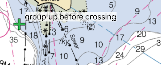

When you are done, you must save the waypoint data or it will go away when the
project is closed. To do this, click the small "computer chip" icon to the right of the layer
name in the Layers panel:

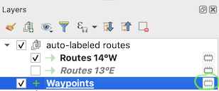

A dialog will appear that lets you specify a filename on your computer where
the waypoints will be saved. The circled "..." button below lets you choose
the folder and filename for the waypoint data.

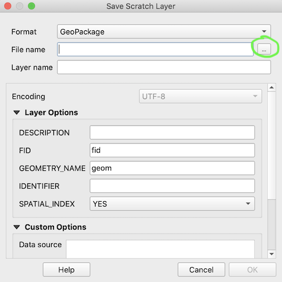

This only has to be done once. In the future the project will remember where the
waypoint layer data is saved.

You can double click the layer name to edit various properties of how the
markers look, are colored, labeled, etc. These are quite involved and beyond
the scope of this guide but they are easy to experiment with.

### Compass Routes plugin

A very useful planning tool is the Compass Routes plugin, which will let you
plot your own routes automatically labelled with distance and magnetic bearing. It will also let you create your own magnetic north lines for any area. The variation for the current date is automatically calculated, so you don't need to consult any tables or other maps.

To install this plugin, do the following:
- open up the Plugin Manager by using the **Plugins > Manage and Install Plugins...** menu command
- go to the **Settings** tab and check the box labeled *Show also experimental plugins* (otherwise you won't see the plugin, which is currently considered experimental.)
- go to the **Not Installed** tab and enter "Compass Routes" in the search text box
- select *Compass Routes* and install it

Documentation for the plugin can be found [here](https://joeberkovitz.github.io/qgis-compass-routes).

### Adding route segments with compass bearings

Use the Compass Routes plugin to add a new compass routes layer (see the
documentation available via the link above.) Now use **Edit > Add Line
Feature** (short cut Ctrl-. or Command-.) to change the mouse to a tool that
adds route segments.

To add each individual segment, you will need to carry out this sequence:
- left-click on the starting point,
- left-click on the finishing point,
- right-click anywhere on the map. (on a trackpad, this is a two-finger click usually. On single-button mouse computers, you will need to find out how you simulate a right click for your machine.)

The result looks like this:

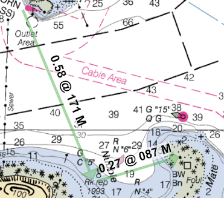

As with [waypoints](#adding-waypoints) above, you must make your route layer
permanent and save its data on your computer or it will disappear as soon as
you close the project.

To make new auto-labeled compass route layers, please use the [Compass Routes plugin](#compass-routes-plugin).

### Adding custom layers

You are not limited to working with the data included in the template project.
For example, here is a link to a [public database of wind
turbines](https://eerscmap.usgs.gov/uswtdb/data/) maintained by the US
Geological service, at least as of 2021. Visit this page and download the
GeoJSON format file described there.

Then use **Layer > Add Layer > New Vector Layer...** to load the GeoJSON file
into QGIS. Make sure the new layer is above the charts or you won't see it.
Now your map will include the locations of all US wind turbines. You can also
use advanced features of QGIS like the Identify tool to look up information
about the turbines like their height, their location, their names and so
forth. Learning how to do this with QGIS is a worthwhile exercise.

### Simplifying the user interface

QGIS has a lot of extra bells and whistles that you may never use. To
declutter the toolbars, you can use the **Settings > Interface
Customization...** command. Use the Load From File icon (yellow folder) to
load the `customization.ini` file that you can download from
[here](customization/customization.ini) and save on your computer. Then click
OK and restart QGIS with a simpler user interface.
